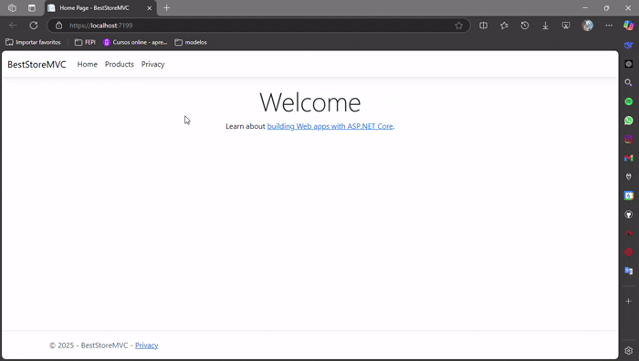

# BestStoreMVC

## **Descrição**
O **BestStoreMVC** é uma aplicação desenvolvida com Blazor e .NET 9 para gerenciar produtos de forma eficiente. A aplicação permite criar, editar, visualizar e excluir produtos, oferecendo uma interface moderna e responsiva.

## **Funcionalidades**
- **Gerenciamento de Produtos**:
  - Adicionar novos produtos com informações detalhadas.
  - Editar e excluir produtos existentes.
  - Validação de dados no formulário.
- **Interface Responsiva**:
  - Construída com Bootstrap para garantir compatibilidade com dispositivos móveis e desktops.
- **Upload de Arquivos**:
  - Suporte para upload de imagens de produtos.
- **Acessibilidade**:
  - Implementação de boas práticas para acessibilidade, como o uso de `role="button"`.

## **Tecnologias Utilizadas**
- **Blazor**: Framework para desenvolvimento de interfaces web interativas.
- **.NET 9**: Plataforma para desenvolvimento de aplicações modernas e de alto desempenho.
- **C# 13.0**: Linguagem de programação utilizada no backend e na lógica do Blazor.
- **Bootstrap**: Framework CSS para design responsivo.

## **Estrutura do Projeto**
### **Páginas**
- **`Views/Products/Create.cshtml`**:
  - Página para criação de novos produtos.
  - Inclui formulários com validação e suporte para upload de arquivos.

### **Modelos**
- **`ProductDto`**:
  - Modelo de dados utilizado para representar os produtos.
  - Propriedades:
    - `Name`: Nome do produto.
    - `Brand`: Marca do produto.
    - `Category`: Categoria do produto.
    - `Price`: Preço do produto.
    - `Description`: Descrição do produto.
    - `ImageFileName`: Nome do arquivo de imagem.

## **Como Executar o Projeto**
1. Certifique-se de ter o **.NET 9 SDK** instalado.
2. Clone o repositório do projeto: `git clone <URL_DO_REPOSITORIO>`
3. Navegue até o diretório do projeto: `cd <DIRETORIO_DO_PROJETO>`
4. Restaure as dependências: `dotnet restore`
5. Execute o projeto: `dotnet run`
6. Acesse a aplicação no navegador em `http://localhost:5000`.

## **Validação**
- A validação é implementada usando `asp-validation-for` para exibir mensagens de erro ao lado dos campos do formulário.
- Certifique-se de que os dados inseridos atendam aos requisitos definidos no modelo `ProductDto`.

## Créditos 

Este projeto foi inspirado pelo tutorial de Codingblue disponível no canal do YouTube. Agradecimentos 
especiais a Codingblue por compartilhar seu conhecimento e
ajudar a comunidade de desenvolvedores.